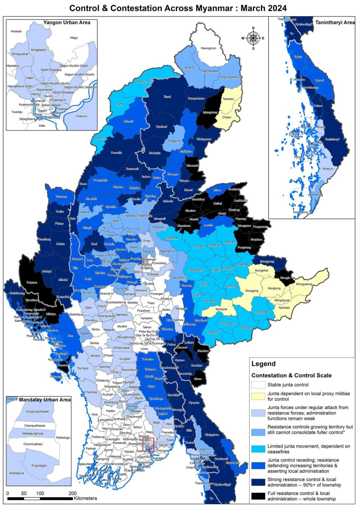

```{r setup, include=FALSE}
knitr::opts_chunk$set(echo = FALSE,
                      message = FALSE,
                      warning = FALSE,
                      comment = "")
```

# R Markdown

**R Markdown** uses *markdown* language to render your reports and manuscripts. One click is all is need to write up your desire document types:

-   **Writer documents**
    -   *Microsoft word file*
    -   *PDF file*
        -   require Tex and a little bit annoying
    -   *HTML file*
-   **Presentation**
    -   *PowerPoint*
-   **Interactive document**
    -   *Shiny dashboard*

## How to write R Markdown cheaply

Three essential components:

1.  **YAML Header**

    -   At the start of the file
    -   Write between two "---"
    -   Use indentations for options

2.  **Text**

    -   

        ### Header is hashtags followed by one space

    -   *italic* **bold** ***italic bold*** ^superscript^ ~subscript~

    -   Tap two space and Enter to separate paragraphs\
         or backlash for new line

    -   Tab plus dash plus Tab for un-ordered list items

        1.  Number plus Tab is ordered list

    -   $equation = formuala$ to insert equation

    -   $$E = mc^{2}$$ to insert equation block

    -   to insert ***URL***: <https://www.facebook.com/>

    -   [Attached link](https://www.facebook.com/)

        

    -   Image file must be in **same folder** as ***Rmd file***.\
        Online image can also be used but permission denial may encounter

3.  **Code Chunk**

    -   write between two verbatim mark as follow:

    ```{r}
    print("Write the code here")
    ```

    -   $shortcut=ctrl+alt+i$
    -   {r codename, include = TRUE or FALSE} to include the code in your report\
    -   It's better use the **finalfit** code together with **dplyr/magrittr**, and **knitr** packages

### Example

1.  **Load the packages and set up**\

```{r attachPackage, include=FALSE}
rm(list = ls())
library(magrittr)
library(mStats)
library(ggplot2)
library(finalfit)
```

We don't want the package attaching here, so include = F.\
Also for the following sections, include=F.

2.  **Import the data set**\

```{r readData, include=FALSE}
hiv <- readxl::read_excel("C:/docs/R_teaching/data/pone_Adherence_ART.xls")

```

3.  **Transform data**\

```{r transformData, include=FALSE}
hiv.tables <- hiv %>% 
  # Remove unnecessary variables
  dplyr::select(!c(DiagnHIV, 
                   CTX, 
                   Vitamin, 
                   IPT, 
                   Infection, 
                   Adherence, 
                   AdherenceR)) %>% 
  # Re-code categorical values to characters
  recode(Sex,"F"/"Female", "M"/"Male") %>% 
  recode(TB, "y"/"Positive", "n"/"Negative") %>% 
  recode(District, 1/"Misungwi", 2/"others") %>% 
  recode(WHOstage, 1/"I", 2/"II", 3/"III", 4/"IV") %>% 
  # Generate ARV as a new variable for abbreviation
  generate(ARV, ARVregimen) %>% 
  # Re-code ARV as character
  recode(ARV, 1/"3TC+AZT+NVP", 2/"3TC+AZT+EFV", 3/"ABC+3CT+EFV",
         4/"ABC+3TC+LPV/r", 5/"ABC+3TC+LPV/r", 6/"TDF+FDC+ATV/r",
         7/"ABC+3TC+ATV/r") %>% 
  generate(ARVpi, ifelse(ARVregimen < 4, "Non-PI", "PI")) %>% 
  # new variable to calculate time on ART: date difference / 365.25 = years
  generate(timeART, as.numeric(as.Date("2017-12-31") - as.Date(ARVStart)) / 365.25) %>% 
  # factorize time of ART into categories
  egen(timeART, 
       cut = c(2.0,6.0,9.0), 
       lbl = c("3-24M", "25M-5Yr", "6-8Yr", "9+Yr"),
       new_var = timeART.grp) %>% 
  # number of ARV tablets taken
  egen(ARVtablet, 
       cut = c(2.5,4.5,6), 
       lbl = c("<=2.4", "2.5-4.4", "4.5-5.9", "6+"),
       new_var = ARVtab.grp) %>% 
  # Re-code nutrition
  recode(Nutrition, 1/"Normal", 2/"Moderate", 3/"Severe") %>% 
  # CD4 group cut-off point 351
  egen(CD4,
       cut = c(0,351),
       lbl = c("<=350","351+"),
       new_var = cd4.grp1) %>% 
  # CD4 group cut-off point 500
  egen(CD4,
       cut = c(0,501),
       lbl = c("<=500","501+"),
       new_var = cd4.grp2) %>% 
  # re-code relation
  recode(Relation, 1/ "Mother", 2/"Father", 3/"Relative", 4/"Others") %>% 
  # re-code HIV care giver
  recode(RelativeHIV, "y"/"Yes", "n"/"No") %>% 
  # re-code siblings' HIV
  recode(SiblingsHIV, "y"/"Yes", "n"/"No") %>% 
  # re-code care giver's literacy
  recode(Literacy, "y"/"Yes", "n"/"No") %>% 
  # generate new variable for viral load suppression 
  generate(vlSuppress, ifelse(VLcat < 2, 1, 0)) %>% 
  # Keep the variables that we will use
  dplyr::select(Sex, TB, District, WHOstage, ARVpi, ARV, timeART.grp, ARVtab.grp,
                Nutrition, cd4.grp1, Relation, RelativeHIV, SiblingsHIV, Literacy,
                timeART, Nregimens, cd4.grp2, vlSuppress) %>% 
  # label the variable
  label(Sex = "Gender",
        TB = "History of TB",
        District = "District: 1=Misungwi,2=others", 
        WHOstage ="WHO Clinical Staging",
        ARVpi = "ART PI-NonPI", 
        ARV = "ARV regimens", 
        timeART.grp = "Time on ART Category",
        ARVtab.grp = "number of ARV tablet/day", 
        Nutrition = "Nutritional Status",
        cd4.grp1 = "CD4 group: 350", 
        Relation = "Relation with Caregiver", 
        RelativeHIV = "HIV+ Caregiver",
        SiblingsHIV = "HIV+ Siblings", 
        Literacy = "Literacy of caregiver",
        timeART = "Time on ART Years", 
        Nregimens = "Previous Regimens", 
        cd4.grp2 = "CD4 group: 500", 
        vlSuppress = "Viral Suppression")
```

4.  Set up your final fitted outcomes and explanatory

```{r setFinalfit, include=F}
dependent <- "vlSuppress"
explanatory <- names(hiv.tables)[-18]
```

From now on, we want our output in the file. So, include=T.

5.  **Exploratory data analysis**

```{r EDA, include=TRUE, fig.cap="Figure 1. Viral laod suppression by duration of ART", fig.align='left'}
hiv.tables %>% 
  ggplot(mapping = aes(x = vlSuppress, y = timeART.grp))+
  geom_col(fill = "#00BE68")+
  labs(x = "Number of cases with viral load suppression",
       y = "ART duration")+
  theme_bw()
```

\n

6.  Tables\
    **Table 1. Background characteristics of patients taking ART**

```{r table1, include=TRUE}
hiv.tables %>% 
  dplyr::mutate(vlSuppress = factor(vlSuppress,
                                    levels = c(0,1),
                                    labels = c("No","Yes"))) %>% 
  summary_factorlist(
  dependent = dependent,
  explanatory = explanatory,
  total_col = T,
  add_col_totals = T,
  digits = c(2,2,3,2,0)
) -> t1
knitr::kable(
  t1,
  col.names = c("Variables","Values","No","Yes","Total"),
  align = c("l","l","r","r","r")
)
```

**Table 2. Comparing characteristics of patients taking ART with viral load suppression status**

```{r table2, include=TRUE}
hiv.tables %>% 
  dplyr::mutate(vlSuppress = factor(vlSuppress,
                                    levels = c(0,1),
                                    labels = c("No","Yes"))) %>% 
  summary_factorlist(
  dependent = dependent,
  explanatory = explanatory,
  cont = "median",
  cont_range = T,
  p = T,
  p_cat = "fisher",
  digits = c(2,2,3,2,0)
) -> t2
knitr::kable(
  t2,
  col.names = c("Variables","Values","No","Yes","P value"),
  align = c("l","l","r","r","r")
)
```


```{r testFinalfit, include=FALSE}
hiv.tables %>% 
  dplyr::mutate(vlSuppress = factor(vlSuppress,
                                    levels = c(0,1),
                                    labels = c("No","Yes"))) %>%
  finalfit(
    dependent = "vlSuppress",
         explanatory = c("timeART.grp","Sex","Nutrition"),
         explanatory_multi = "timeART.grp",
         metrics = T
  )
```

**Table 3. Binary logistic regression**  

```{r tableFinalfit, include=TRUE}
hiv.tables %>% 
  dplyr::mutate(vlSuppress = factor(vlSuppress,
                                    levels = c(0,1),
                                    labels = c("No","Yes"))) %>%
  finalfit(
    dependent = "vlSuppress",
    explanatory = c("timeART.grp","Sex","Nutrition"),
    add_dependent_label = T) %>% 
  knitr::kable() 
```

